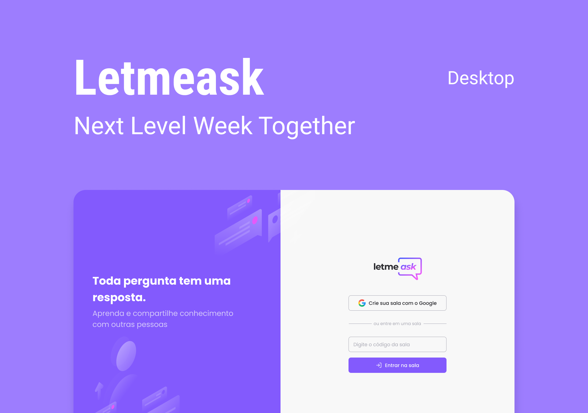

<p align="center">
   
</p>
<h3 align="center">
   Next Level Week Together 👨🏻‍🚀 🚀
</h3>

<p align="center">
  

  

  	
  <a href="https://www.linkedin.com/in/victor-kodama/">
    
  </a>
	
  
  <a href="https://github.com/victorkengoo/letmeask/commits/master">
    
  </a>

  
   
   <a href="https://github.com/victorkengoo/letmeask/stargazers">
    
  </a>
   
</p>




## 🛠 Tecnologias

This project was developed using the following technologies:

- [React][reactjs]
- [TypeScript][typescript]
- [Firebase][firebase]


## 🚀 Run the project

```bash
# Clone the project
$ git clone https://github.com/VictorKengoo/letmeask

# Access the folder
$ cd letmeask

# Install the dependencies
$ yarn

# Start the project
$ yarn start

# The app will be available for access on your browser at http://localhost:3000
```

## 🔖 Layout 

You can view the project layout through the links below:

[Figma][prototipo]

Remembering that you need to have a [Figma][figma] account to access it.


## 📝 License
This project is licensed under the MIT License.


Made with ❤️ by Victor Kodama 👋🏽 [Entre em contato!](https://www.linkedin.com/in/victor-kodama/)

[typescript]: https://www.typescriptlang.org/
[reactjs]: https://reactjs.org
[firebase]: https://firebase.google.com/
[prototipo]: https://www.figma.com/file/wNgEV5v2vX00TKi4NzyGD4/Letmeask-Copy?fuid=767115048822343972
[figma]: https://figma.com
